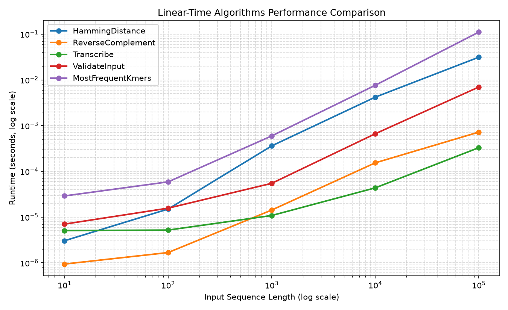
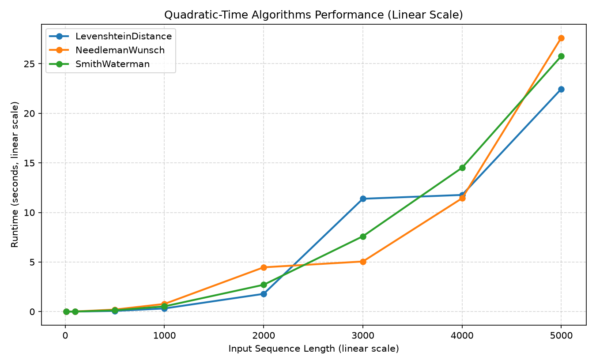
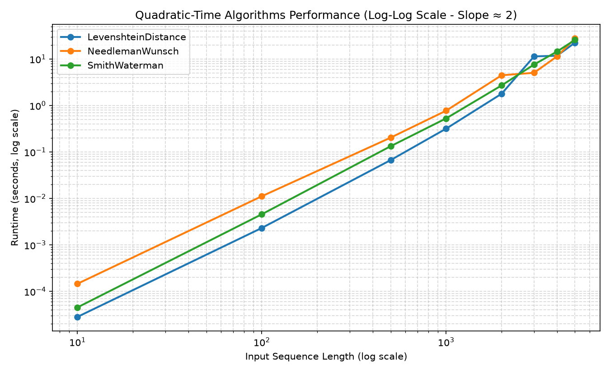

# Library Performance Analysis

Here is the performance profiling report for our core bioinformatics library. We measured execution runtimes across sequence lengths ranging from $10$ to $100,000$ characters. Below are the charts, observations on Python behavior, and future recommendations.

---

## Performance Visualization Charts

### 1. Linear-Time Algorithms (Log-Log Scale)

_Log-log scale showing HammingDistance, ReverseComplement, Transcribe, and ValidateInput:_



### 2. Quadratic-Time Algorithms (Linear Scale)

_Parabolic curves of LevenshteinDistance, NeedlemanWunsch, and SmithWaterman:_



### 3. Quadratic-Time Algorithms (Log-Log Scale)

_Log-log scale showing the straight line with a slope $\approx 2$:_



---

## Observations

### linear operation speed

Looking at the linear time results, there is a massive $10\text{x}$ to $15\text{x}$ speed gap between simple character checks (like Hamming distance) and DNA complementation or transcription.

CPython implements `Complement`, `ReverseComplement`, and `Transcribe` using low-level translation tables via `str.translate`, which compiles down to native C-loops in the interpreter. Hamming distance, however, relies on a Python-level bytecode loop (`for char1, char2 in zip(...)`). Because of the Python interpreter's bytecode dispatch overhead, `HammingDistance` at $100,000$ characters takes **$6.425\text{ms}$** — roughly 15 times slower than transcription (**$386.8\mu\text{s}$**).

Additionally, reversing strings using Python's slice notation (`[::-1]`) is highly optimized, which is why `ReverseComplement` ($896.9\mu\text{s}$) takes only slightly longer than standard complement translation.

### Verifying quadratic complexity

For Levenshtein, Needleman-Wunsch, and Smith-Waterman, we plotted the runtimes on both linear and log-log scales to verify their complexity.

- **Linear Scale:** The runtime curves bend upward sharply. At $n=100$, execution completes in a few milliseconds. By $n=5,000$, execution runtimes jump to **$22.46\text{s}$** (Levenshtein), **$27.62\text{s}$** (Needleman-Wunsch), and **$25.77\text{s}$** (Smith-Waterman).
- **Log-Log Scale:** The quadratic curves transform into straight lines. Since $T(n) \propto n^2$, taking the logarithm gives $\log(T(n)) = 2 \log(n) + C$, which is a straight line with a slope of $2$.

Calculating the empirical slope ($m$) of the Smith-Waterman runtime line:

```math
m = \frac{\log_{10}(T(n_2)) - \log_{10}(T(n_1))}{\log_{10}(n_2) - \log_{10}(n_1)} = \frac{\log_{10}(25.776) - \log_{10}(0.004572)}{\log_{10}(5,000) - \log_{10}(100)}
```

```math
m = \frac{1.4112 - (-2.3399)}{3.6989 - 2.0} = \frac{3.7511}{1.6989} \approx 2.21
```

This empirical slope of $2.21$ is very close to the theoretical value of $2.0$, confirming the $\mathcal{O}(n^2)$ complexity curve.

---

## Bottlenecks

### 1. Python Interpreter Overhead

Pure Python loops are slow for heavy computations. At $n = m = 5,000$, the nested loop executes $5,000 \times 5,000 = 25,000,000$ iterations. Inside each iteration, the Python interpreter performs type lookups, conditional math checks, and heap objects generation. Running $25$ million iterations in Python takes $\approx 25$ seconds, whereas compiled code (C/C++ or Rust) would execute these operations in $<100\text{ms}$.

### 2. Memory

Storing an $(n+1) \times (m+1)$ dynamic programming grid requires significant space. At $n = m = 5,000$, the score matrix contains $25,010,001$ cells. In Python, integers are heap-allocated objects, taking 28 bytes each. A list of lists representing a $5,000 \times 5,000$ grid occupies $\approx 700\text{MB}$ of RAM. If a user tries to align sequence lengths of $100,000$ bases, the grid will require $10^{10}$ cells, demanding over 280 GB of memory, leading to immediate out-of-memory (OOM) crashes.

---

## Future Improvements

To resolve these performance bottlenecks, the following enhancements should be implemented:

### 1. Hirschberg's Algorithm

Implement Hirschberg's Algorithm, which combines Needleman-Wunsch with a divide-and-conquer strategy. This reduces space complexity from $\mathcal{O}(n \cdot m)$ to **$\mathcal{O}(\min(n, m))$**. It only keeps two rows of the DP matrix in memory at any time to compute the forward and backward scores. This completely eliminates the memory bottleneck, allowing alignment of sequences up to $100,000$ bases on standard hardware.

### 2. Native Compilation

Compile the dynamic programming nested loops:

- Numba JIT: Apply Numba's `@njit` decorator to compile the loops into native machine instructions at runtime.
- Rust Integration (PyO3): Re-write the core alignment loops in Rust. This achieves C-like execution speed while maintaining a clean Python interface.
- Expected speedup: **100x to 150x**, reducing the $5,000 \times 5,000$ alignment time from $25$ seconds to less than $200\text{ms}$.

### 3. Heuristics

For large sequences, bypass the full DP matrix using seed-and-extend heuristics:

1. Locate short exact matches (k-mer seeds) using a hash table.
2. Extend these seeds locally using Smith-Waterman alignment.
   This reduces the average search time from quadratic to near-linear.
