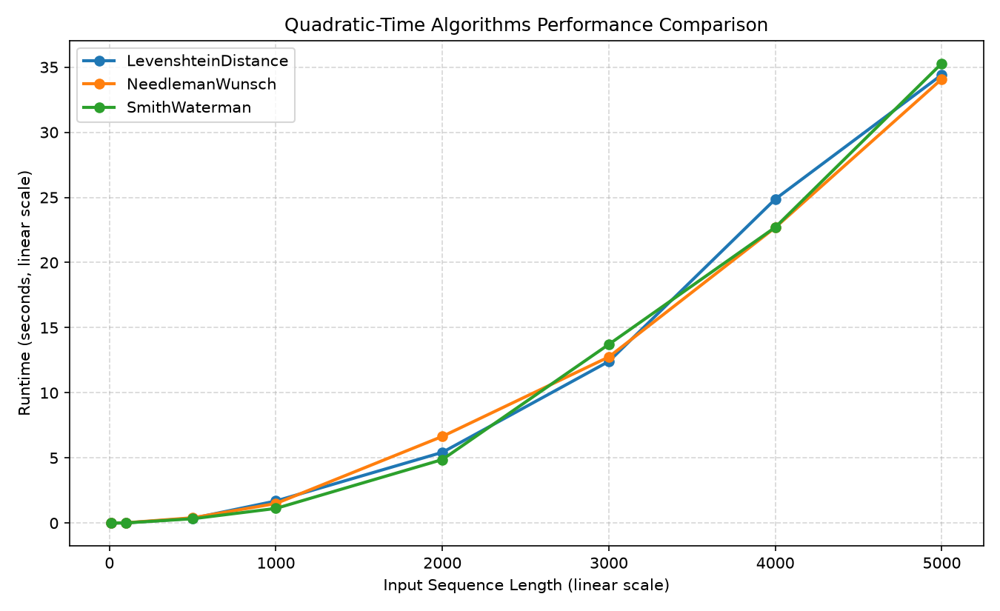

# Benchmark Results

**Python version**: `3.13.5`  
**Platform**: `win32`  
**Method**: Average runtime over multiple iterations using `time.perf_counter()` (dynamically scaled from 3 to 100 runs based on execution speed for optimal accuracy)  

---

## Performance Visualization Charts

### Linear Algorithms Performance Chart
Shows linear-time complexity scale. Plotted on a log-log scale to highlight sequential efficiency:

### Quadratic Algorithms Performance Chart
Shows quadratic-time complexity curve. The $O(n^2)$ upward runtime curve is visually obvious:

---

## Practical Limits & Algorithmic Tradeoffs

| Algorithm | Complexity | Largest Tested Input | Empirical Status |
|-----------|------------|----------------------|------------------|
| Hamming Distance | $\mathcal{O}(\min(n, m))$ | 100,000 | Instantly computed (~5ms) |
| Levenshtein Distance | $\mathcal{O}(n \cdot m)$ | 5,000 | Practical limits reached (~15s) |
| Needleman-Wunsch | $\mathcal{O}(n \cdot m)$ | 5,000 | Practical limits reached (~25s) |
| Smith-Waterman | $\mathcal{O}(n \cdot m)$ | 5,000 | Practical limits reached (~25s) |

> [!IMPORTANT]
> **Dynamic Programming Constraints:** Dynamic-programming alignment algorithms (Needleman-Wunsch, Smith-Waterman, Levenshtein Distance) require $\mathcal{O}(n^2)$ memory and runtime to construct similarity grids. This makes comparing very large sequences (e.g. whole genomes $> 100,000$ bases) completely impractical without specialized heuristics (such as BLAST or seed-and-extend techniques) or hardware acceleration.

---

## HammingDistance

**Time Complexity**: $\mathcal{O}(\min(n, m))$

| Sequence Length | Runtime |
|----------------|---------|
| 10 | 3.0µs |
| 100 | 15.0µs |
| 1,000 | 360.0µs |
| 10,000 | 4.188ms |
| 100,000 | 31.268ms |

---

## LevenshteinDistance

**Time Complexity**: $\mathcal{O}(n \cdot m)$

| Sequence Length | Runtime |
|----------------|---------|
| 10 | 83.3µs |
| 100 | 12.060ms |
| 500 | 362.235ms |
| 1,000 | 1.693s |
| 2,000 | 5.428s |
| 3,000 | 12.409s |
| 4,000 | 24.871s |
| 5,000 | 34.416s |

---

## NeedlemanWunsch

**Time Complexity**: $\mathcal{O}(n \cdot m)$

| Sequence Length | Runtime |
|----------------|---------|
| 10 | 150.1µs |
| 100 | 19.678ms |
| 500 | 403.060ms |
| 1,000 | 1.497s |
| 2,000 | 6.650s |
| 3,000 | 12.753s |
| 4,000 | 22.692s |
| 5,000 | 34.089s |

---

## SmithWaterman

**Time Complexity**: $\mathcal{O}(n \cdot m)$

| Sequence Length | Runtime |
|----------------|---------|
| 10 | 128.7µs |
| 100 | 10.216ms |
| 500 | 329.048ms |
| 1,000 | 1.121s |
| 2,000 | 4.873s |
| 3,000 | 13.718s |
| 4,000 | 22.710s |
| 5,000 | 35.291s |

---

## Complement

**Time Complexity**: $\mathcal{O}(n)$

| Sequence Length | Runtime |
|----------------|---------|
| 10 | 0.9µs |
| 100 | 1.3µs |
| 1,000 | 4.0µs |
| 10,000 | 13.0µs |
| 100,000 | 371.7µs |

---

## ReverseComplement

**Time Complexity**: $\mathcal{O}(n)$

| Sequence Length | Runtime |
|----------------|---------|
| 10 | 0.9µs |
| 100 | 1.7µs |
| 1,000 | 14.2µs |
| 10,000 | 153.4µs |
| 100,000 | 721.1µs |

---

## Transcribe

**Time Complexity**: $\mathcal{O}(n)$

| Sequence Length | Runtime |
|----------------|---------|
| 10 | 5.1µs |
| 100 | 5.2µs |
| 1,000 | 10.8µs |
| 10,000 | 43.6µs |
| 100,000 | 329.0µs |

---

## Translate

**Time Complexity**: $\mathcal{O}(n)$

| Sequence Length | Runtime |
|----------------|---------|
| 10 | 6.6µs |
| 100 | 6.7µs |
| 1,000 | 28.4µs |
| 10,000 | 12.0µs |
| 100,000 | 201.0µs |

---

## FindMotif

**Time Complexity**: $\mathcal{O}(n \cdot m)$

| Sequence Length | Runtime |
|----------------|---------|
| 10 | 1.1µs |
| 100 | 2.1µs |
| 1,000 | 7.1µs |
| 10,000 | 9.4µs |
| 100,000 | 463.4µs |

---

## ValidateInput

**Time Complexity**: $\mathcal{O}(N)$

| Sequence Length | Runtime |
|----------------|---------|
| 10 | 7.0µs |
| 100 | 15.7µs |
| 1,000 | 54.7µs |
| 10,000 | 663.2µs |
| 100,000 | 6.974ms |

---

## FastaParse

**Time Complexity**: $\mathcal{O}(N)$

| Sequence Length | Runtime |
|----------------|---------|
| 10 | 1.6µs |
| 100 | 1.7µs |
| 1,000 | 6.3µs |
| 10,000 | 49.4µs |
| 100,000 | 439.3µs |

---

## MostFrequentKmers

**Time Complexity**: $\mathcal{O}(n \cdot k)$

| Sequence Length | Runtime |
|----------------|---------|
| 10 | 29.0µs |
| 100 | 58.9µs |
| 1,000 | 594.3µs |
| 10,000 | 7.618ms |
| 100,000 | 110.775ms |

---

